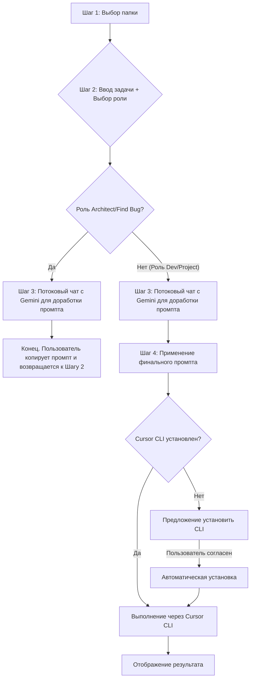

## Контекст
Эта архитектура описывает обновленный, итеративный и условно-логический рабочий процесс приложения. Цель — предоставить пользователю гибкий инструмент, который адаптируется под конкретную задачу (роль), будь то архитектурное планирование или разработка.

## Структура
Рабочий процесс состоит из 4-х шагов, управляемых фронтенд-логикой (Vue). Навигация между шагами не является строго линейной.

## Поведение
1.  **Шаг 1 и 2**: Пользователь выбирает проект, вводит задачу и выбирает "роль" (например, `Architect`, `Dev`).
2.  **Шаг 3 (Чат)**: Для всех ролей открывается интерфейс потокового чата с Gemini для итеративной доработки и уточнения промпта.
3.  **Условный переход**:
    -   **Для ролей `Architect` и `Find Bug`**: Рабочий процесс завершается после Шага 3. Предполагается, что результат (финальный промпт) является самодостаточным, и пользователь копирует его для дальнейшего использования.
    -   **Для ролей `Dev` и `Project`**: После доработки промпта в чате, пользователь переходит на Шаг 4.
4.  **Шаг 4 (Выполнение)**: На этом шаге происходит взаимодействие с `cursor-agent` CLI. UI динамически адаптируется, предлагая либо установить CLI, либо выполнить команду с финальным промптом.

## Эволюция
### Планируется
- Добавление новых ролей с уникальной логикой рабочего процесса.
- Интеграция с другими инструментами на Шаге 4.

### История
- v2: Внедрение условной логики на основе ролей и интеграция потокового чата.
- v1: (Предполагается) Линейный рабочий процесс без чата и автоматической установки CLI.

